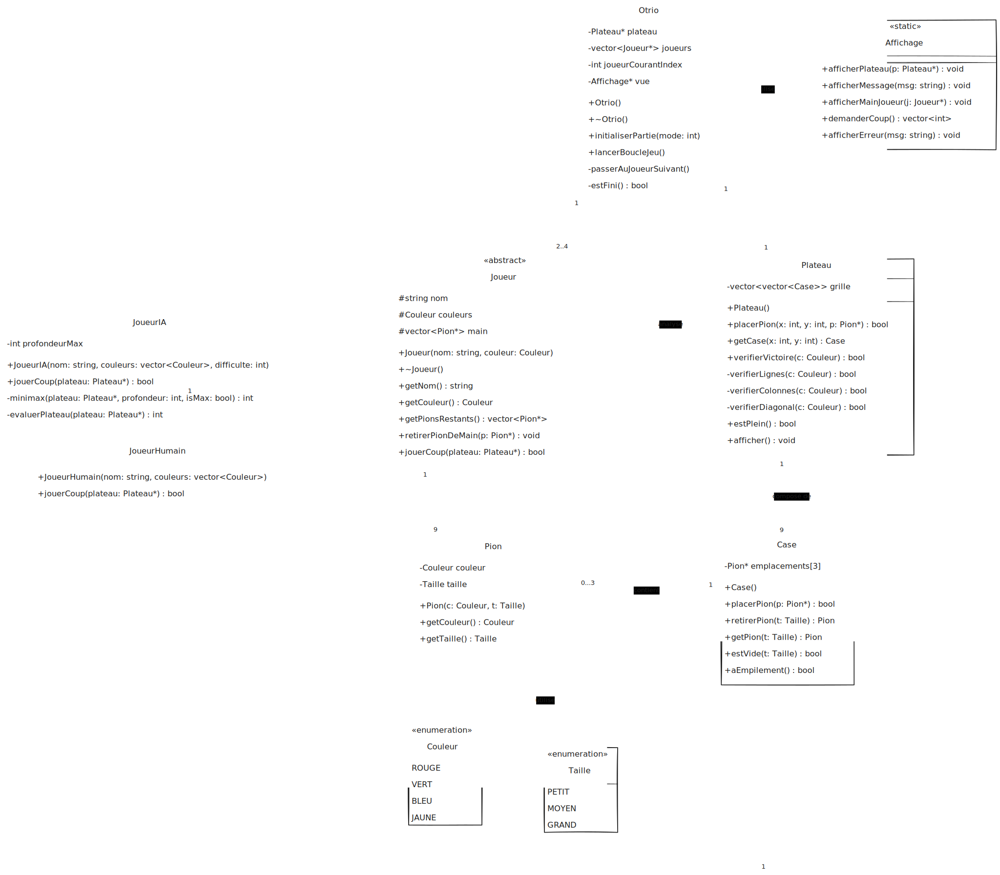

# TP6 - TP noté jeu Otrio

SEC 2

- Eloi Tourangin - <eloi.tourangin@eleves.ec-nantes.fr>
- Lucas Oros - <lucas.oros@eleves.ec-nantes.fr>
- Djamael Lahamion - <djamael.lahamion@eleves.ec-nantes.fr>
- Aloïs Guillon - <alois.guillon@eleves.ec-nantes.fr>

Lien github : https://github.com/ECN-SEC-SMP/tp6-note-alois_lucas_djamael_eloi

## Table des matières

- [TP6 - TP noté jeu Otrio](#tp6---tp-noté-jeu-otrio)
  - [Table des matières](#table-des-matières)
  - [Organisation du groupe](#organisation-du-groupe)
    - [Répartition initiale](#répartition-initiale)
  - [Compilation et Exécution](#compilation-et-exécution)
  - [Diagramme des classes](#diagramme-des-classes)
  - [Description des classes](#description-des-classes)
    - [Classe Otrio](#classe-otrio)
    - [Classe Joueur](#classe-joueur)
    - [Classe JoueurHumain](#classe-joueurhumain)
    - [Classe JoueurIA](#classe-joueuria)
    - [Classe Plateau](#classe-plateau)
    - [Classe Case](#classe-case)
    - [Classe Pion](#classe-pion)
    - [Classe Affichage](#classe-affichage)
  - [Concepts Clés](#concepts-clés)

## Organisation du groupe

Nous avons débuter le projet par une étape de modélisation où chacun a pu proposer une solution.
Puis, nous nous sommes répartis le travail.

### Répartition initiale

Chaque membre du groupe a pris en charge un ensemble cohérent de classes du projet :

- **Lucas** : classe `Otrio` et `Case`, gestion de la boucle de jeu et des tours
- **Eloi** : classes `Plateau` et `Affichage`, affichage du plateau
- **Djamaël** : classes `Joueur`, `JoueurHumain`, gestion des coups joueurs
- **Aloïs** : classe `Pion`, enums (`Couleur`, `Taille`) et tests unitaires

## Dépendances, Compilation et Exécution

Utiliser le script bash pour installer les dépendances, compiler et exécuter le programme :

```bash
./build_and_execute.sh
```

Il peut être nécessaire de réaliser un dos2unix sur le script avant exécution.
Surtout dans une configuration, édition sous windows puis exécution sous WSL.

```bash
dos2unix build_and_execute.sh
```

Alternative (CMake) :

```bash
mkdir -p build && cd build
cmake ..
cmake --build .
./Otrio_Game
```

## Diagramme des classes



## Description des classes

### Classe Otrio

#### Description

La classe `Otrio` est la classe principale du programme.  
Elle gère le déroulement global de la partie en orchestrant :

- l'initialisation des joueurs,
- la gestion du plateau,
- l'enchaînement des tours de jeu,
- la détection de la fin de partie.

Elle constitue le point d'entrée logique du jeu.

#### Méthodes 

| Méthode | Description |
|--------|-------------|
| `initialiserPartie()` | Initialise le plateau et demande les noms des joueurs |
| `lancerBoucleJeu()` | Lance la boucle principale du jeu |
| `estFini()` | Vérifie si un joueur a gagné |
| `passerAuJoueurSuivant()` | Change le joueur courant |
| `afficherEtatJeu()` | Affiche l'état du plateau et des joueurs |

#### Tests de Otrio

Dans `main.cpp`, la partie "Test Otrio" n'est pas encore automatisée :  
les tests d'intégration sont réalisés par exécution du programme complet et par interaction avec `JoueurHumain`.

Les classes `Plateau` et `Joueur` étant déjà testées, la robustesse de `Otrio` se valide principalement en conditions réelles d'exécution (enchaînement de tours et détection de victoire).

#### Gestion des Exceptions de Otrio

`Otrio` délègue :

- la validation des entrées utilisateur à `JoueurHumain`,
- la validation des placements à `Plateau`.

Ainsi, aucune exception n'est nécessaire au niveau de `Otrio` pour le déroulement nominal du jeu.

---

### Classe Joueur

#### Description

La classe `Joueur` est une classe abstraite représentant un joueur générique du jeu Otrio.  
Elle définit les attributs communs à tous les joueurs :

- un nom,
- une couleur,
- une main de pions.

Elle impose également l'implémentation de la méthode `jouerCoup`.

#### Méthodes principales

| Méthode | Description |
|--------|-------------|
| `virtual bool jouerCoup(Plateau* p) = 0` | Interface de jeu à implémenter |
| `std::string getNom()` | Retourne le nom du joueur |
| `Couleur getCouleur()` | Retourne la couleur du joueur |
| `void retirerPion(const Pion&)` | Retire un pion de la main |
| `bool hasPion(const Pion&)` | Vérifie si un pion est en main |

---

### Classe JoueurHumain

#### Description

La classe `JoueurHumain` hérite de `Joueur` et représente un joueur réel interagissant via le terminal.  
Elle implémente la logique de saisie utilisateur pour :

- choisir un pion parmi ceux restants,
- sélectionner une position valide sur le plateau.

Cette classe gère également l'affichage de la main du joueur.

#### Méthodes principales

| Méthode | Description |
|--------|-------------|
| `bool jouerCoup(Plateau*)` | Gère l'interaction utilisateur pour jouer un coup |
| `void afficherMain()` | Affiche les pions encore disponibles |

#### Tests de Joueur

Le test `test_Joueur()` effectue les vérifications suivantes :

- création d'un `JoueurHumain("Alice", ROUGE)`,
- vérification du nom et de la couleur via `assert`,
- vérification du nombre de pions initiaux (`NB_GROUPES_PIONS * NB_PIONS_PAR_TAILLE`),
- retrait d'un pion de la main et vérification que la taille diminue de 1,
- test d'un coup réel via `jouerCoup(&plateau)` sur un plateau valide, puis affichage du plateau.

Ce test combine vérifications unitaires (assert) et interaction utilisateur.

#### Gestion des exceptions de Joueur/JoueurHumain

Dans notre implémentation, `jouerCoup()` gère les erreurs de saisie de manière robuste :
- si l'entrée n'est pas numérique, le flux est nettoyé puis une nouvelle saisie est demandée,
- si la taille est invalide, l'utilisateur est invité à recommencer,
- si le pion n'existe pas dans la main, un message est affiché et l'utilisateur recommence,
- si le placement échoue (`placerPion` retourne `false`), l'utilisateur recommence.

L'objectif est de ne pas interrompre la partie à cause d'une erreur utilisateur.

---

### Classe JoueurIA

#### Description

La classe `JoueurIA` hérite de `Joueur` et représente un joueur automatisé (IA simple).  
Elle implémente une stratégie de jeu de base pour :

- sélectionner automatiquement un pion valide,
- déterminer une position de placement selon une heuristique simple.

Cette classe permet de jouer contre l'ordinateur ou de tester rapidement le jeu.

#### Méthodes principales

| Méthode | Description |
|--------|-------------|
| `bool jouerCoup(Plateau*)` | Calcule et exécute un coup automatiquement |
| `Pion choisirPion()` | Sélectionne un pion (ex. premier disponible) |
| `std::pair<int,int> choisirPosition(Plateau*, const Pion&)` | Détermine les coordonnées de placement |

#### Implémentation

La version fournie contient une IA basique :

- **Stratégie de sélection** : itère sur la main et prend le premier pion jouable,
- **Stratégie de position** : parcourt le plateau et place le pion à la première position valide.

Cette implémentation peut être améliorée avec :

- une heuristique pour privilégier les emplacements défensifs/offensifs,
- un algorithme minimax ou alpha-beta pour une IA plus forte,
- priorité aux positions gagnantes ou bloquantes.

---

### Classe Plateau

#### Description

La classe `Plateau` représente la grille de jeu du Otrio, composée de 9 cases organisées en une grille 3×3.  
Chaque case peut contenir jusqu'à trois pions de tailles différentes (PETIT, MOYEN, GRAND).

La classe est responsable :

- du placement des pions,
- de la vérification des conditions de victoire,
- de l'accès aux cases.

#### Méthodes principales

| Méthode | Description |
|--------|-------------|
| `bool placerPion(int x, int y, const Pion& pion)` | Place un pion sur le plateau si la position est valide |
| `bool verifierVictoire(Couleur c)` | Vérifie si une couleur satisfait une condition de victoire |
| `void afficher()` | Affiche l'état du plateau dans le terminal |
| `Case* getCase(int x, y)` | Retourne un pointeur vers une case du plateau |

#### Tests de Plateau

Deux fonctions de test sont présentes :

##### `test_Plateau_v1()`

Ce test mélange affichage et jeu interactif :

- création d'un plateau et affichage initial,
- placement de quelques pions "en dur" puis affichage,
- création de deux joueurs (`Alice` ROUGE, `Bob` BLEU),
- `Alice` joue trois coups via `jouerCoup(&plateau)`,
- affichage du plateau puis vérification de victoire avec `plateau.verifierVictoire(j1.getCouleur())`.

Ce test sert principalement de démonstration interactive.

##### `test_Plateau()`

Ce test est plus "unitaire" et utilise `assert` pour valider plusieurs scénarios indépendants :

- **Test 0 : plateau vide** → aucune victoire pour aucune couleur,
- **Test 1 : placements de base** (placements valides, refus sur même taille, refus hors plateau),
- **Test 2 : victoire par alignement identique** (3 PETITS alignés),
- **Test 3 : victoire par alignement croissant** (PETIT → MOYEN → GRAND),
- **Test 4 : victoire par empilement complet** (PETIT+MOYEN+GRAND sur une même case),
- **Test 5 : victoire décroissante** (GRAND → MOYEN → PETIT) sur une diagonale.

> Remarque : dans le code actuel, la couleur `JAUNE` est utilisée dans les tests.  
> Pour rester conforme à l'énoncé Otrio, il faut remplacer `JAUNE` par `VIOLET`.

#### Gestion des exceptions de Plateau

La classe `Plateau` n'interrompt pas le programme par exception lors des erreurs de jeu courantes.  
Les cas invalides sont gérés par retour `false`, par exemple :

- coordonnées hors plateau (`x` ou `y` hors `[0..2]`),
- pointeur de pion nul,
- placement refusé par une `Case` (taille déjà occupée).

Ce choix simplifie la gestion dans `JoueurHumain::jouerCoup()` (qui peut redemander une saisie).

---

### Classe Case

#### Description

La classe `Case` représente une position du plateau.  
Elle peut contenir au maximum un pion de chaque taille (PETIT, MOYEN, GRAND).

Elle assure :

- la vérification de la disponibilité d'une taille,
- l'interdiction de placer deux pions de même taille sur une même case.

#### Méthodes principales

| Méthode | Description |
|--------|-------------|
| `bool estVide(Taille t)` | Vrai si pas de pion de cette taille |
| `bool placerPion(const Pion& p)` | Place un pion selon sa taille si libre |
| `bool retirerPion(Taille t)` | Retire un pion et retourne succès |
| `Pion* getPion(Taille t)` | Accès au pion ou `nullptr` |

#### Tests de Case

Le test `test_Case()` vérifie les comportements suivants :

- placement d'un pion PETIT puis MOYEN dans une case vide,
- vérification de l'état via `estVide(Taille)` (PETIT et MOYEN occupés, GRAND libre),
- récupération correcte via `getPion(Taille)`,
- retrait d'un pion (`retirerPion(MOYEN)`) et vérification que la case redevient vide sur cette taille,
- re-placement du pion MOYEN puis placement du pion GRAND pour constituer un empilement complet.

Ces tests permettent de garantir les invariants fondamentaux d'une case.

#### Gestion des exceptions de Case

La classe `Case` ne lève pas d'exception dans le flux normal de jeu.  
Les actions invalides (ex : placer un pion sur une taille déjà occupée) sont gérées par retour `false` (selon l'implémentation), ce qui facilite la gestion d'erreur dans `Plateau` et `JoueurHumain`.

---

### Classe Pion

#### Description

La classe `Pion` représente une pièce du jeu Otrio.  
Chaque pion est caractérisé par :
- une couleur,
- une taille.

Les pions sont utilisés par les joueurs pour tenter de remplir les conditions de victoire.

#### Méthodes principales

| Méthode | Description |
|--------|-------------|
| `Couleur getCouleur()` | Retourne la couleur du pion |
| `Taille getTaille()` | Retourne la taille du pion |
| `Pion(Couleur c, Taille t)` | Constructeur |

#### Tests de Pion

Le test `test_Pion()` valide la création et l'intégrité des attributs de plusieurs pions :

- création de trois pions : `(ROUGE, PETIT)`, `(BLEU, MOYEN)`, `(VERT, GRAND)`,
- vérification avec `assert` que `getCouleur()` et `getTaille()` retournent les valeurs attendues.

L'objectif est de garantir que la classe se comporte comme un simple conteneur de données fiable pour le reste du projet.

#### Gestion des exceptions de Pion

La classe `Pion` ne déclenche pas d'exception dans notre implémentation :  
les valeurs sont encadrées par des enums et les invariants sont garantis par conception.

---

### Classe Affichage

#### Description

La classe `Affichage` est responsable de toute la présentation du jeu dans le terminal.  
Elle encapsule l'affichage du plateau, des joueurs et des messages pour assurer une séparation claire entre le modèle et la vue.

Cette architecture facilite les évolutions futures (ex. interface graphique, export en fichier, etc.).

#### Méthodes principales

| Méthode | Description |
|--------|-------------|
| `void afficherPlateau(const Plateau& p)` | Affiche la grille 3×3 avec les pions présents |
| `void afficherMain(const Joueur& j)` | Affiche les pions restants du joueur |
| `void afficherMessage(const std::string& msg)` | Affiche un message générique à l'écran |
| `void afficherEtatJoueurs(const std::vector<Joueur*>& joueurs)` | Affiche les infos des joueurs (nom, couleur) |
| `void afficherGagnant(const Joueur& j)` | Affiche le message de fin et le gagnant |

#### Implémentation

La classe `Affichage` propose :

- une organisation claire du code d'affichage pour faciliter les mises à jour,
- possibilité d'ajouter des couleurs ANSI ou des symboles Unicode pour améliorer la présentation,
- centralisation des formats pour garantir cohérence visuelle.

Exemple d'améliorations possibles :

- utiliser des codes couleur ANSI pour différencier les joueurs,
- ajouter des symboles Unicode (♔, ●, ○) pour représenter les pions visuellement,
- créer des variantes d'affichage (mode ASCII, mode coloré, mode minimaliste).

---

## Concepts Clés

### Hérédité et polymorphisme

Le projet utilise l'**hérédité** pour structurer les joueurs :

```
Joueur (classe mère abstraite)
  ├── JoueurHumain (classe fille)
  └── JoueurIA (classe fille)
```

### Concepts C++ utilisés

#### **Pointeurs et références**

- Pointeurs vers classes : `Plateau* p`, `Joueur* j`.
- Permet le polymorphisme et l'allocation dynamique.
- Utilisés pour passer des objets complexes sans copie.

#### **Conteneurs (std::vector)**

- `std::vector<Pion> main` : stocke les pions d'un joueur.
- `std::vector<Case> cases` : grille du plateau (9 cases).
- `std::vector<Joueur*> joueurs` : liste des joueurs dans `Otrio`.

#### **Enums (énumérations)**

```cpp
enum class Couleur { ROUGE, BLEU, VERT, VIOLET, JAUNE, ... };
enum class Taille { PETIT, MOYEN, GRAND };
```

- Type-safe : empêche les valeurs invalides.
- Améliore la lisibilité du code.

#### **Méthodes virtuelles et surcharge**

- `virtual bool jouerCoup(Plateau* p) = 0` dans `Joueur`.
- Chaque classe fille fournit sa propre implémentation.
- Liaison dynamique : la bonne méthode est appelée selon le type réel.

#### **Paires (std::pair)**

- `std::pair<int,int>` : retourner deux coordonnées (x, y).
- Exemple dans `JoueurIA::choisirPosition()`.

#### **const et références const**

- `const Plateau& p` : passage en référence sans copie, immutable.
- Protège contre les modifications accidentelles.

### Enums et constantes

- `Couleur` : ROUGE, BLEU, VERT, VIOLET, JAUNE, ... (les couleurs des joueurs)
- `Taille` : PETIT, MOYEN, GRAND (les trois tailles de pions)
- Constantes : `NB_GROUPES_PIONS`, `NB_PIONS_PAR_TAILLE`, etc.

### Conditions de victoire (règles Otrio)

Le jeu reconnaît plusieurs façons de gagner (à implémenter selon l'énoncé) :

1. **Alignement identique** : trois pions de même taille et couleur alignés (ligne, colonne ou diagonale).
2. **Alignement croissant** : PETIT → MOYEN → GRAND alignés de même couleur.
3. **Alignement décroissant** : GRAND → MOYEN → PETIT alignés de même couleur.
4. **Empilement complet** : même case contenant PETIT + MOYEN + GRAND de même couleur.

### Architecture générale

- **Modèle** : `Plateau`, `Case`, `Pion` — gèrent l'état du jeu.
- **Logique** : `Otrio`, `Joueur*` — orchestrent et implémentent les règles.
- **Présentation** : `Affichage` — gère l'affichage console.

### Gestion des erreurs

- Pas d'exceptions pour les opérations courantes du jeu (saisie invalide, placement refusé).
- Retours booléens pour signaler succès/échec.
- La classe `JoueurHumain` boucle jusqu'à obtenir une entrée valide.
- `Plateau` et `Case` valident les règles et retournent `false` en cas d'erreur.

### Distribution des pions

Chaque joueur reçoit une main contenant un nombre défini de pions (ex. `NB_GROUPES_PIONS * NB_PIONS_PAR_TAILLE` pions).  
Les pions sont retirés de la main à chaque placement et ne peuvent pas être replacés. La partie se termine quand :

- un joueur a réalisé une condition de victoire, ou
- plus aucun coup valide n'est possible.

### Organisation du code source

- **Headers** : `include/*.hpp` — déclarations des classes et interfaces.
- **Sources** : `src/*.cpp` — implémentations et définitions.
- **Tests** : `main.cpp` — fonctions `test_*()` et point d'entrée.
- **Build** : `CMakeLists.txt` — configuration CMake.
